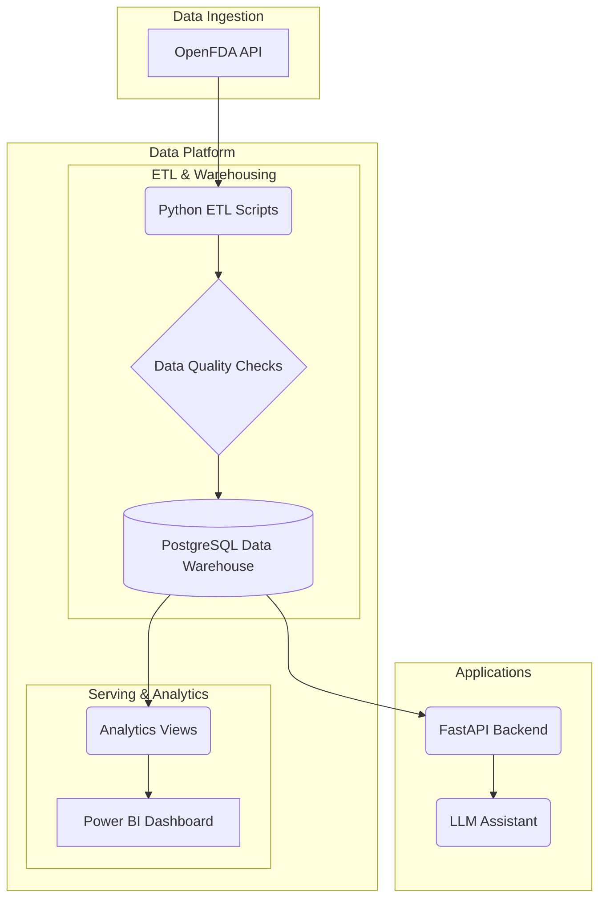

# LifeSci Sentinel

LifeSci Sentinel is a data engineering project that ingests drug safety event data from the OpenFDA API, processes it through an ETL pipeline, and loads it into a data warehouse for analytics and further use by downstream applications.

## Architecture

The project follows a modern data stack architecture, ensuring data quality, scalability, and ease of use for analytics and AI-driven applications.

