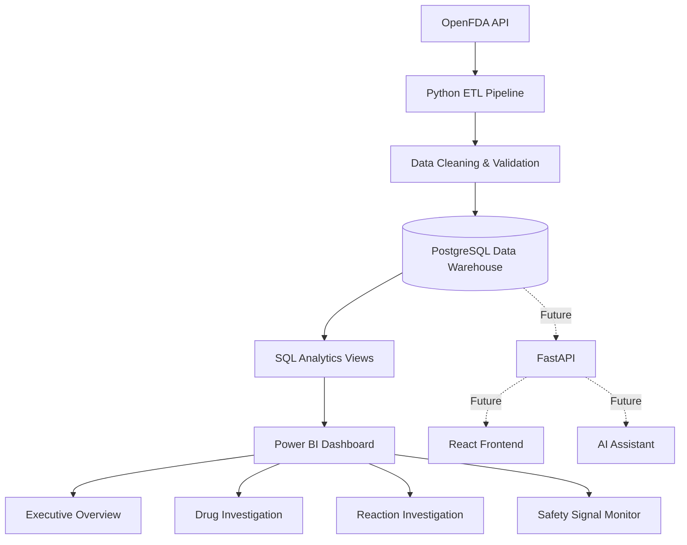

# 🧬 LifeSci Sentinel

**LifeSci Sentinel** is an end-to-end healthcare analytics platform that transforms real-world pharmacovigilance data from the **OpenFDA API** into interactive business intelligence dashboards for drug safety monitoring, adverse event investigation, and safety signal detection.

The project combines **Data Engineering, Data Warehousing, SQL Analytics, and Power BI** to demonstrate how raw healthcare data can be converted into actionable insights for pharmaceutical and life sciences organizations.

---

## ✨ Features

- 🔄 Automated ETL pipeline using Python
- 🌐 Real-time data ingestion from the OpenFDA API
- 🏗️ PostgreSQL Star Schema Data Warehouse
- 📊 Interactive Power BI Executive Dashboards
- 🧪 Drug Investigation Dashboard
- 💊 Reaction Investigation Dashboard
- ⚠️ Safety Signal Monitoring Dashboard
- 📈 DAX KPIs and Business Metrics
- ✅ Data Quality Validation
- 🔍 Drill-through Analytics
- 📋 SQL Analytical Views

---

## 🏗️ Architecture



---

## 📊 Dashboard Modules

### 1️⃣ Executive Overview

- Executive KPIs
- Reporting Trends
- Drug Distribution
- Severity Distribution

### 2️⃣ Drug Investigation

- Drug Risk Profile
- Priority Score
- Drug Ranking
- Adverse Reaction Analysis
- Reporting Timeline

### 3️⃣ Reaction Investigation

- Reaction-level Analysis
- Affected Drugs
- Serious Report Analysis
- AI-style Summary Panel

### 4️⃣ Safety Signal Monitor

- Drug Risk Landscape
- Priority Score Monitoring
- Critical Drug Detection
- Safety Signal Exploration

---

## 🛠 Tech Stack

| Category | Technologies |
|----------|--------------|
| Programming | Python |
| Database | PostgreSQL |
| Analytics | SQL |
| Visualization | Power BI, DAX |
| Data Source | OpenFDA API |
| Data Processing | Pandas, NumPy |

---

## 📂 Project Workflow

```
OpenFDA API
      ↓
Python ETL
      ↓
Data Quality Validation
      ↓
PostgreSQL Warehouse
      ↓
SQL Analytics Views
      ↓
Power BI Dashboards
      ↓
Business Insights
```

---

## 🚀 Future Enhancements

- FastAPI REST API
- React Dashboard
- AI Drug Safety Assistant
- Natural Language Queries
- Automated Report Generation

---

## 📸 Dashboard Preview

(Add screenshots here)

- Executive Overview
- Drug Investigation
- Reaction Investigation
- Safety Signal Monitor

---

## 🎯 Business Value

LifeSci Sentinel demonstrates an end-to-end healthcare analytics workflow that enables:

- Drug safety monitoring
- Adverse event investigation
- Executive reporting
- Safety signal identification
- Data-driven decision support
