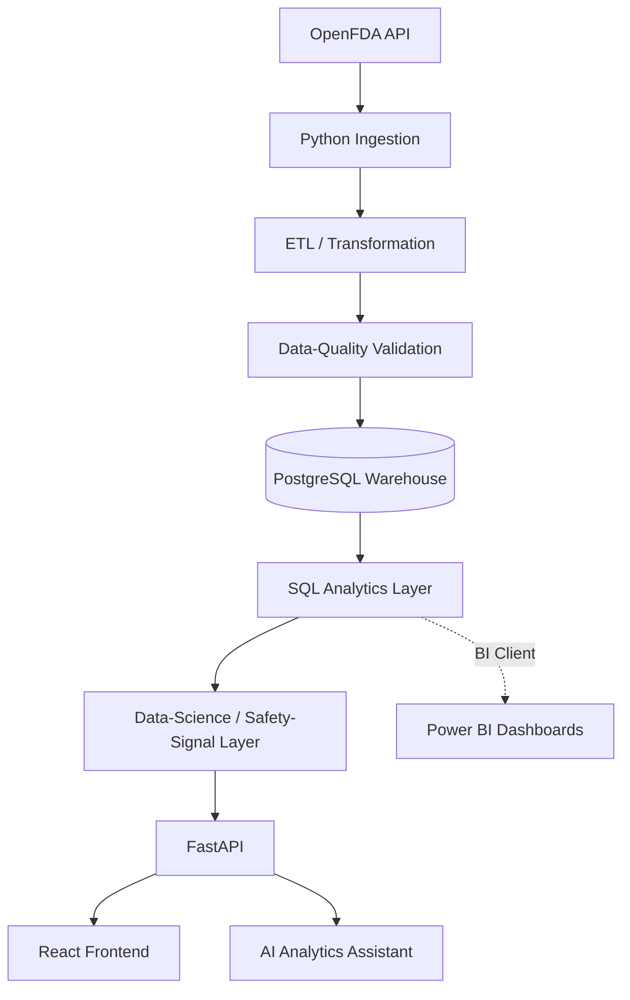

# 🧬 LifeSci Sentinel

**LifeSci Sentinel** is an end-to-end healthcare drug-safety intelligence platform that transforms real-world pharmacovigilance data from the **OpenFDA API** into validated, explainable safety signals served through a modern web application.

The platform combines **Data Engineering, Data Warehousing, SQL Analytics, Data Science, FastAPI, React, and a grounded AI assistant** to demonstrate how raw regulatory data can become trustworthy analytical intelligence for pharmaceutical and life-science decision support.

> **Important:** LifeSci Sentinel provides **analytical decision support** based on available adverse-event reporting data. It does **not** provide medical diagnosis, treatment recommendations, or establish causality. All risk classifications are analytical signals that require further investigation.

---

## 📌 Original (Legacy) Version — Power BI + PostgreSQL

This release is the **updated full-stack version** of the project. It **builds on and preserves** the original foundation that was built first. The legacy version remains compatible and is described here for clarity.

### Original Foundation

The original project was an **end-to-end data engineering + analytics pipeline** that converted raw OpenFDA pharmacovigilance data into interactive **Power BI** dashboards backed by **PostgreSQL**:

```
OpenFDA API
    ↓  Python Ingestion (src/ingestion)
data/raw/
    ↓  ETL / Transformation (src/transformation)
data/processed/ (silver layer)
    ↓  Warehouse Gold Build (src/warehouse/build_*.py)
data/gold/ (star schema CSVs)
    ↓  Database Load (src/database/load_*.py)
PostgreSQL schema `warehouse`
    ↓  SQL Analytics (src/analytics/*.py)
data/analytics/*.csv
    ↓
Power BI dashboards (DAX, KPIs, interactive filters, drill-through)
```

### Original Power BI Dashboards

The original project shipped **4 Power BI dashboards** (preserved and actively used):

1. **Executive Overview** — executive KPIs, reporting trends, drug & severity distribution
2. **Drug Investigation** — drug risk profile, priority score, drug ranking, adverse reaction analysis, reporting timeline
3. **Reaction Investigation** — reaction-level analysis, affected drugs, serious-report analysis
4. **Safety Signal Monitor** — drug risk landscape, priority-score monitoring, critical-drug detection, safety-signal exploration

### Original PostgreSQL Warehouse

The original **PostgreSQL** schema **`warehouse`** (star schema) remains the authoritative data source, unchanged and fully compatible:

| Table | Type |
|-------|------|
| `warehouse.dim_date` | Dimension |
| `warehouse.dim_drug` | Dimension |
| `warehouse.dim_reaction` | Dimension |
| `warehouse.fact_drug_safety_events` | Fact |
| `warehouse.fact_event_reaction` | Fact |

The original **priority methodology** (`signal_priority.py`) is preserved exactly: `priority_score = 0.40×serious_rate + 0.35×normalized_reports + 0.25×reaction_diversity_index`, with labels **High** (≥70), **Medium** (≥40), **Low** (<40).

### What the Updated Version Adds

The updated version adds, **on top of and alongside** the original Power BI/PostgreSQL foundation (without modifying or replacing it), a modern web intelligence layer:

- A reusable analytics service (`src/analytics/service.py`) and a configurable **LOW / MODERATE / HIGH / CRITICAL** risk-classification overlay (`config/risk_rules.json`)
- A **FastAPI** backend (`api/`) exposing a read-only analytics API
- A **React** frontend (Vite + TypeScript + Tailwind) with 6 pages
- A **grounded AI analytics assistant** (offline rule-based engine by default, optional LLM enhancement)
- A **pytest** test suite (43 tests) and this rewritten README

Power BI remains a fully supported, read-only analytical client of the same PostgreSQL/analytics layer, entirely independent of the new web application.

---

## Why This Project Exists

Adverse-event reports (AERs) are collected by regulators but are noisy and difficult to interpret. Raw FAERS/OpenFDA data needs:

- **Validation** — to ensure completeness, freshness, and referential integrity
- **Transformation** — into a clean dimensional model
- **Analytics** — into drug/reaction safety metrics
- **Signal detection** — to prioritize combinations worth investigating
- **Explainability** — so analysts understand *why* a signal was flagged

LifeSci Sentinel operationalizes this pipeline and exposes it through a professional analytics UI and a grounded AI assistant.

---

## Real Data Source

- **API:** [OpenFDA Drug Adverse Event API](https://open.fda.gov/apis/drug/event/)
  - Endpoint: `https://api.fda.gov/drug/event.json`
- **Dataset:** ~999 adverse-event reports, 266 drugs, ~916 reaction types
- All numbers are derived from the actual ingested data — nothing is synthetic.

---

## Architecture


```mermaid
graph TD
    A[OpenFDA API] --> B[Python Ingestion]
    B --> C[ETL / Transformation]
    C --> D[Data-Quality Validation]
    D --> E[(PostgreSQL Warehouse)]
    E --> F[SQL Analytics Layer]
    F --> G[Data-Science / Safety-Signal Layer]
    G --> H[FastAPI]
    H --> I[React Frontend]
    H --> J[AI Analytics Assistant]
    F -. BI Client .-> K[Power BI Dashboards]
```

The architecture keeps clear separation between **ingestion, transformation, warehouse, analytics, business logic, API, AI, and frontend**.

---

## Data Engineering

The pipeline follows the classic phases:

### EXTRACT
- `src/ingestion/openfda_ingest.py` — retrieves adverse-event data from OpenFDA
- `src/ingestion/inspect_openfda.py` — profiles the raw response
- Output: `data/raw/adverse_events.csv`

### TRANSFORM
- `src/transformation/silver_drug_safety.py` — flattens events and extracts drug name
- `src/transformation/extract_reactions.py` — extracts reaction lists
- Output: `data/processed/` (silver layer)

### WAREHOUSE (LOAD)
- `src/warehouse/build_*.py` — build the gold star-schema layer
- `src/database/load_all.py` — loads gold CSVs into PostgreSQL atomically
- Output: PostgreSQL schema `warehouse`

### ANALYTICS
- `src/analytics/drug_metrics.py` → `drug_metrics.csv`
- `src/analytics/feature_engineering.py` → `features.csv`
- `src/analytics/signal_priority.py` → `priority_scores.csv`
- `src/analytics/reaction_patterns.py` → `drug_reaction_patterns.csv`
- `src/analytics/top_reactions.py` → `top_reactions.csv`

---

## Data Warehouse

PostgreSQL schema **`warehouse`** (star schema):

| Table | Type |
|-------|------|
| `warehouse.dim_date` | Dimension |
| `warehouse.dim_drug` | Dimension |
| `warehouse.dim_reaction` | Dimension |
| `warehouse.fact_drug_safety_events` | Fact |
| `warehouse.fact_event_reaction` | Fact |

Connection utility: `src/database/connection.py` (psycopg2, environment-driven).

---

## Data Quality

Quality checks in `src/quality/`:

- **Completeness** — required columns populated 100%
- **Nulls** — missing-value scan
- **Duplicates** — duplicate event detection
- **Freshness** — historical or live snapshot validation
- **Referential integrity** — fact → dimension key validation

---

## Safety Signal Methodology

### Priority Score (existing, preserved)
The existing priority engine (`signal_priority.py`) computes a weighted score:

```
priority_score = 0.40 × serious_rate
              + 0.35 × normalized_reports
              + 0.25 × reaction_diversity_index
```

Existing labels: **High** (≥70), **Medium** (≥40), **Low** (<40). This methodology is **unchanged** for backward compatibility.

### Risk Classification (new, configurable overlay)
A new, transparent classifier (`service.classify_risk`) maps signals to:

```
LOW · MODERATE · HIGH · CRITICAL
```

Thresholds are configurable in `config/risk_rules.json`. This layer consumes the existing priority score and serious rate and is **documented as an analytical overlay** — it does not alter the existing priority output.

---

## Power BI

The existing Power BI dashboards remain an analytical client of the PostgreSQL / analytics layer:

1. **Executive Overview**
2. **Drug Investigation**
3. **Reaction Investigation**
4. **Safety Signal Monitor**

These are preserved and compatible. The web application *complements* Power BI rather than duplicating it.

---

## FastAPI Backend

Located in `api/`. Clean separation: `main.py`, `dependencies.py`, `routes/`, `schemas/`, `services/`.

### Endpoints
- `GET /health`
- `GET /api/analytics/overview`
- `GET /api/analytics/trends`
- `GET /api/drugs`
- `GET /api/drugs/{drug_name}`
- `GET /api/drugs/{drug_name}/reactions`
- `GET /api/reactions`
- `GET /api/reactions/{reaction_name}`
- `GET /api/signals`
- `GET /api/signals/{drug_name}`
- `GET /api/signals/{drug_name}/{reaction_name}`
- `GET /api/signals/{drug_name}/{reaction_name}/investigation`
- `POST /api/ai/query`

All database access is **parameterized**. Raw database exceptions are never exposed.

---

## AI Assistant

A **grounded analytics assistant** (not a generic chatbot). Flow:

```
User question → Intent understanding → Structured analytics retrieval
→ Trusted result set → Explanation → Answer
```

- The **LLM is never the source of truth** — all numbers come from the analytics layer.
- **Default:** a fully functional offline rule-based intent engine + explanation generator (no API key required).
- **Optional:** an OpenAI-compatible LLM integration, enabled via environment configuration, enhances the explanation only.
- **SQL safety:** SELECT-only, read-only DB role, parameterized queries, whitelisted tables, and destructive statements (`INSERT`, `UPDATE`, `DELETE`, `DROP`, `ALTER`, `TRUNCATE`) are blocked.

---

## React Frontend

Built with **Vite + React + TypeScript + Tailwind CSS**.

Pages:
1. **Executive Overview**
2. **Drug Investigation**
3. **Reaction Investigation**
4. **Safety Signals** (interactive signal table)
5. **Signal Investigation** (explainable signal workflow)
6. **AI Assistant**

The UI uses clean typography, restrained colors, responsive layout, and loading/empty/error states.

---

## Setup

### Prerequisites
- Python 3.9+
- Node.js 18+
- PostgreSQL (running)

### Backend
```bash
# 1. Create virtual environment
python -m venv venv
source venv/bin/activate        # Windows: venv\Scripts\activate

# 2. Install dependencies
pip install -r requirements.txt

# 3. Configure environment
cp .env.example .env
# edit .env with your DB credentials

# 4. Run ETL pipeline (optional re-run)
python src/ingestion/openfda_ingest.py
python src/transformation/silver_drug_safety.py
python src/database/load_all.py

# 5. Run the API
uvicorn api.main:app --reload
```

### Frontend
```bash
cd frontend
npm install
npm run dev
```

---

## Environment Variables

| Variable | Description |
|----------|-------------|
| `DB_HOST` | PostgreSQL host |
| `DB_PORT` | PostgreSQL port |
| `DB_NAME` | Database name |
| `DB_USER` | Database user |
| `DB_PASSWORD` | Database password |
| `OPENAI_API_KEY` | *(optional)* LLM key for enhanced explanations |
| `LLM_BASE_URL` | *(optional)* OpenAI-compatible base URL |

See `.env.example` for a template. **No credentials are committed.**

---

## Testing

```bash
pytest -v
```

Tests cover: database connection, serious-rate calculation, priority score, risk classification, analytics services, API health, drug/reaction/signal/investigation endpoints, and AI input validation.

---

## CLI Command Reference

| Task | Command |
|------|---------|
| Ingest OpenFDA | `python src/ingestion/openfda_ingest.py` |
| Transform to silver | `python src/transformation/silver_drug_safety.py` |
| Build warehouse CSVs | `python src/warehouse/build_fact_drug_safety.py` |
| Load into PostgreSQL | `python src/database/load_all.py` |
| Run quality checks | `python src/quality/generate_quality_report.py` |
| Run analytics | `python src/analytics/signal_priority.py` |
| Start API | `uvicorn api.main:app --reload` |
| Start frontend | `cd frontend && npm run dev` |
| Run tests | `pytest -v` |

---

## Limitations

- Analytical decision support only — does not establish causality.
- Reporting data is observational and subject to reporting bias.
- The optional LLM integration requires a valid API key to activate.
- Power BI dashboards are external files documented in the original README sections.

---

## Future Improvements

- Scheduled ingestion automation
- Additional SQL analytical views
- Expanded RAG over FDA drug-safety documents
- Automated alerting for new high-priority signals
- Multi-region / multi-source pharmacovigilance data

---

## Screenshots

*(Add screenshots of the React frontend pages here.)*

- Executive Overview
- Drug Investigation
- Reaction Investigation
- Safety Signals
- Signal Investigation
- AI Assistant
